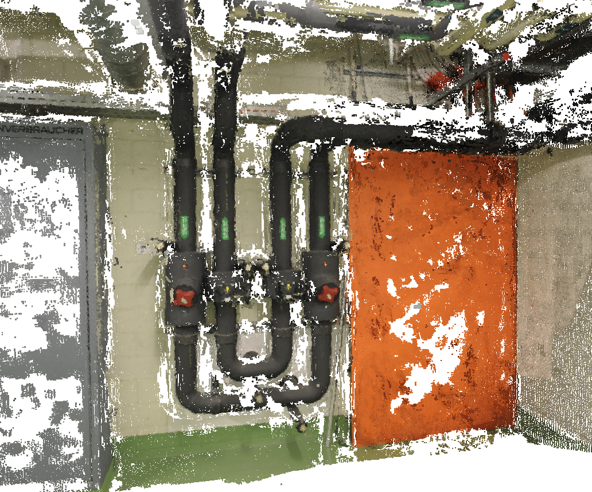
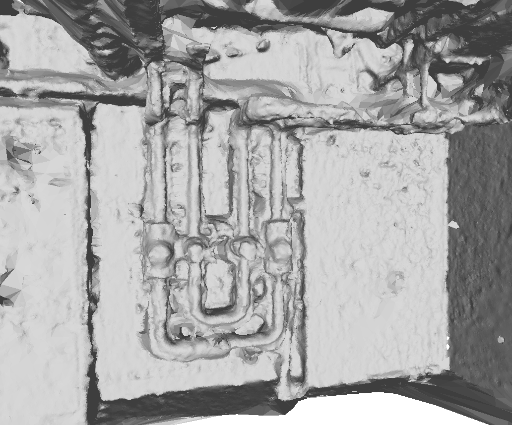
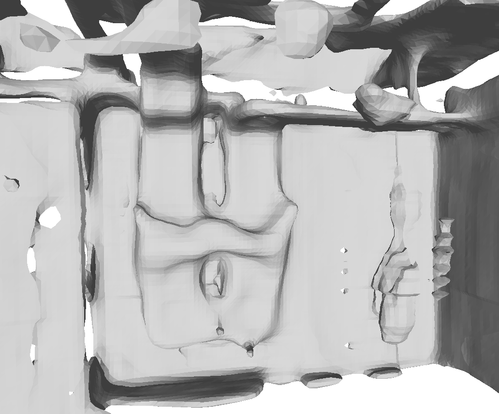

# Scalable Surface Reconstruction with Delaunay-Graph Neural Networks [SGP 2021]
<table>
<thead>
  <tr align="center">
    <th></th>
    <th></th>
    <th></th>
  </tr>
</thead>
<tbody align="center">
  <tr>
    <td>MVS point cloud</td>
    <td>Ours</td>
    <td>ConvONet [1]</td>
  </tr>
</tbody>
</table>

[**Paper**](https://arxiv.org/pdf/2107.06130.pdf) | [**Video**](https://youtu.be/KIrCDGhS10o) <br>

This repository contains the implementation of the paper:

Scalable Surface Reconstruction with Delaunay-Graph Neural Networks<br />
Raphael Sulzer, Loic Landrieu, Renaud Marlet, Bruno Vallet<br />
[**SGP 2021**](https://sgp2021.github.io/program/)  

If you find our code or paper useful, please consider citing
```bibtex
@article{sulzer2021dgnn,
   title={Scalable Surface Reconstruction with Delaunay‐Graph Neural Networks},
   volume={40},
   ISSN={1467-8659},
   url={http://dx.doi.org/10.1111/cgf.14364},
   DOI={10.1111/cgf.14364},
   number={5},
   journal={Computer Graphics Forum},
   publisher={Wiley},
   author={Sulzer, R. and Landrieu, L. and Marlet, R. and Vallet, B.},
   year={2021},
   month={Aug},
   pages={157–167}
}
```


## Installation

Please follow the instructions step-by-step.

1. Clone the repository to your local machine and enter the folder
```bash
git clone git@github.com:raphaelsulzer/dgnn.git
```

2. Create an anaconda environment called `dgnn`
```bash
conda env create -f environment.yaml
conda activate dgnn
```

3. Compile the extension module `libmesh` (taken from [Convolutional Occupancy Networks](https://github.com/autonomousvision/convolutional_occupancy_networks) [1])
```bash
cd utils
python setup_libmesh_convonet.py build_ext --inplace
```

## Surface mesh reconstruction using our pretrained models

### Berger et al. dataset

Reconstruct the Berger et al. [2] dataset from the scans used in our paper.

1. Download and unzip the dataset in the `data` folder

```bash
bash data/download_reconbench.sh
```

2. Reconstruct and evaluate the meshes

```bash
python run.py -i --config configs/pretrained/reconbench.yaml
```

[comment]: <> (### ETH3D dataset)

[comment]: <> (Reconstruct all training scenes of the ETH3D [3] dataset from the MVS point clouds used in the paper.)

[comment]: <> (1. Download and unzip the dataset in the `data` folder)

[comment]: <> (```)

[comment]: <> (cd data)

[comment]: <> (bash download_eth3d.sh)

[comment]: <> (```)

[comment]: <> (2. Reconstruct the meshes)

[comment]: <> (```)

[comment]: <> (python run.py -i --config configs/eth3d.yaml)

[comment]: <> (```)

[comment]: <> (To evaluate the results you can e.g. sample points on the meshes and use the [multi-view-evaluation]&#40;https://github.com/ETH3D/multi-view-evaluation&#41; tool provided by the ETH3D dataset authors.)

### ModelNet10

Reconstruct and evaluate ModelNet10 from 
[Deep Surface Reconstruction from Point Clouds with Visibility Information](https://github.com/raphaelsulzer/dsrv-data)

1. Download and unzip the dataset in the `data` folder
```bash
bash data/download_modelnet.sh
```

2. Reconstruct and evaluate the meshes
```bash
python run.py -i --config configs/pretrained/modelnet.yaml
```

### Custom object or scene

To reconstruct any object or scene from a point cloud you need a `pointcloud.npz` file.
See `Custom dataset` for the structure of the file. 
Additionally you need to adjust the `configs/custom.yaml` file to point to your dataset.

Once you have everything set up run

```bash
python run.py -i --config configs/custom.yaml
```


## Training

Training a new model requires closed ground truth meshes. You can use the procedure explained 
in `Custom dataset` to construct a new dataset from such meshes. Once you have created the dataset you need to
add your dataset to the `getDataset()` function in `processing/dataset.py` and
prepare a `custom.yaml` file (see `configs/reconbench.yaml` for an example). 
The `.yaml` file also allows to change several model parameters.

To train a new model run
```bash
python run.py -t --config configs/custom.yaml
```


[comment]: <> (starting from an existing mesh &#40;see `scan`&#41; or from a)
[comment]: <> (`pointcloud.npz` file &#40;see `feat`, omit `-g` flag&#41;.)

## Custom dataset

To train or reconstruct a custom dataset you need to provide for each object or scene a `pointcloud.npz` file
containing a `points`, `normals` and `sensor_position` field (see `data/reconbench/3_scan/` for examples of
such files). The `normals` field is not actually used in this work but has to be present in the file. 
It can e.g. be set to contain zero vectors. The datatype of all fields has to be `np.float64`.

Furthermore you need several files containing the 3D Delaunay triangulation and feature information for each object
or scene.

We provide prebuild binaries for Ubuntu 18.04 to synthetically scan a mesh, build a 3D Delaunay triangulation,
and extract ground truth labels and features. Note that this uses the scanning procedure introduced in [DSRV](https://github.com/raphaelsulzer/dsrv-data) and not the one from Berger et al. [2] 
used in our paper. 

Scan ground truth mesh
```bash
utils/scan -w path/to/workingDir -i filenameMeshToScan --export npz
```

Extract labels and features
```bash
utils/feat -w path/to/workingDir -i filenameScan -o filenameOutput -g filenameGroundTruthMesh -s npz
```

See `processing/reconbench/feat.py` and `processing/reconbench/scan.py` for examples on how
to batch process all files in your dataset.

If you want further information about the tools used for scanning and feature extraction 
or you want to compile them youself have a look at the [mesh-tools repository](https://github.com/raphaelsulzer/mesh-tools).

## References

[[1] PENG S., NIEMEYER M., MESCHEDER L., POLLEFEYS M.,
GEIGER A.: Convolutional occupancy networks. In ECCV (2020).](https://arxiv.org/abs/2003.04618)

[[2] BERGER M., LEVINE J. A., NONATO L. G., TAUBIN G.,
SILVA C. T.: A benchmark for surface reconstruction. ACM Transaction on Graphics. (2013).](http://vgc.poly.edu/files/berger/recon_bench/paper/tog.pdf)

[[3] SCHÖPS T., SCHÖNBERGER J. L., GALLIANI S., SATTLER
T., SCHINDLER K., POLLEFEYS M., GEIGER A.: A multi-view stereo
benchmark with high-resolution images and multi-camera videos. In
CVPR (2017).](http://www.cvlibs.net/publications/Schoeps2017CVPR.pdf)